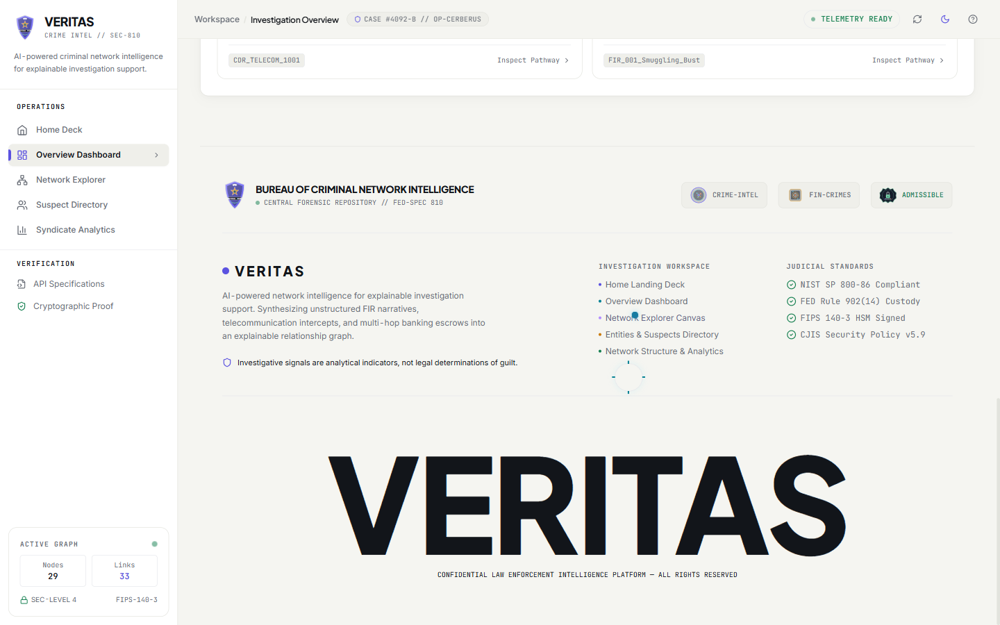
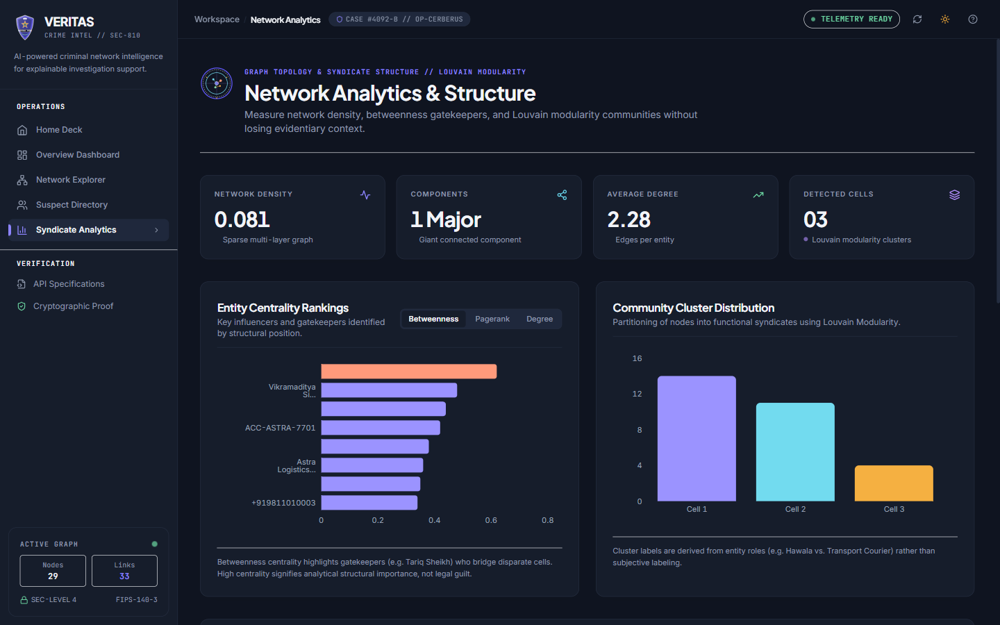
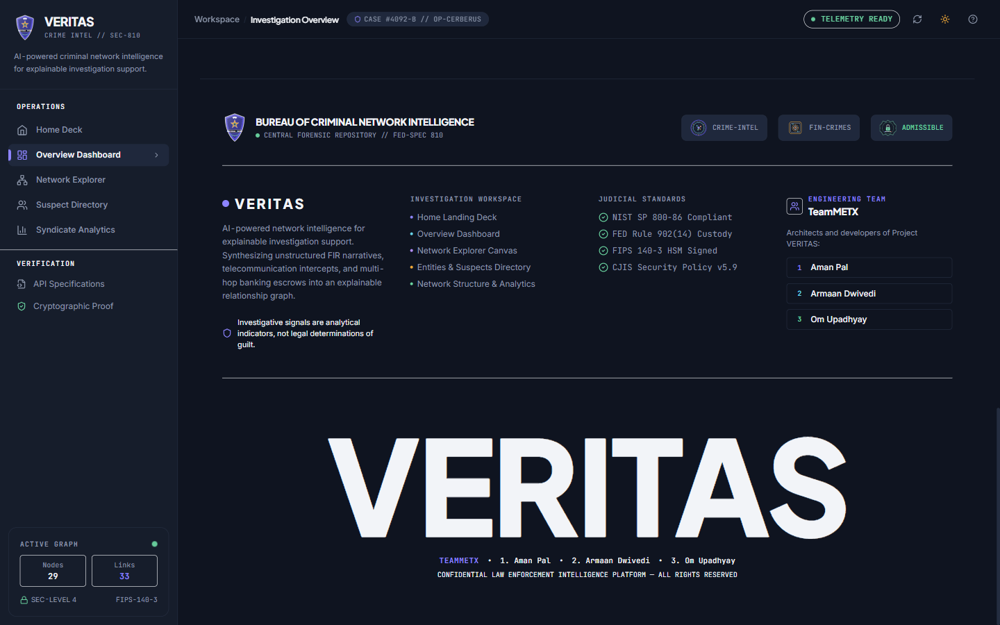

# VERITAS — AI-Powered Criminal Network Analysis & Intelligence Platform

> **KAYA Hackathon 2026** // Transforming fragmented law enforcement records into an explainable relationship graph to uncover hidden syndicates, financial trails, and criminal networks.

[](https://www.python.org/)
[](https://fastapi.tiangolo.com/)
[](https://react.dev/)
[](https://js.cytoscape.org/)
[](https://neo4j.com/)
[](https://networkx.org/)
[](https://tailwindcss.com/)
[-brightgreen.svg)](tests/)
[](LICENSE)

---

## 1. Executive Summary & Problem Statement

Modern criminal operations are increasingly networked, distributed, and multi-layered. Law enforcement agencies capture massive volumes of data across siloed systems:
- **Unstructured text**: Police FIR reports, interrogation summaries, surveillance logs.
- **Telecom records**: Call Detail Records (CDRs), cell tower triangulations, burner phone bursts.
- **Financial channels**: Banking transactions, Hawala ledgers, structured cash deposits.
- **Physical registries**: Vehicle registrations, safehouses, commercial addresses.

**The Core Challenge**: Investigators struggle to uncover hidden multi-hop connections because data is fragmented and manual spreadsheet analysis fails to reveal indirect links. A relationship that appears trivial in isolation becomes critical when combined across sources.

**The VERITAS Solution**: An automated intelligence system that ingests heterogeneous structured and unstructured records, extracts and resolves entities, constructs an explainable multigraph knowledge graph, runs structural network algorithms (Centrality, Louvain Community Detection, Dijkstra Pathfinding), and renders an interactive, professional investigation workspace.

---

## 2. Core Capabilities & Architectural Highlights

- 🔍 **Multi-Source Data Ingestion**: Concurrently parses unstructured police complaints (PDF/TXT) and structured CSV records (CDRs, bank ledgers).
- 🧠 **NLP & Named Entity Recognition (NER)**: Extracts key investigative entities: `Person`, `Phone`, `Vehicle`, `Organization`, `Location`, and `BankAccount`.
- 🔗 **Entity Resolution & Alias Disambiguation**: Uses fuzzy matching (Jaro-Winkler, Levenshtein, Metaphone) to unify multiple aliases and phone formats into singular suspect dossiers.
- 🏛️ **Bureau Landing Deck (`/`)**: Institutional home portal showcasing active operations (`Operation Cerberus`), syndicate telemetry, algorithmic pillars, and specialized crime divisions.
- 📊 **Overview Dashboard (`/dashboard`)**: Minimalist KPI metric cards, stabilized Cytoscape hero network preview, and prioritized evidentiary review signals.
- 🕸️ **Interactive Cytoscape.js Network Explorer (`/network`)**: High-performance canvas featuring force-directed physics, node/edge tap listeners, 72%/28% canvas-to-inspector split, and multi-hop connection tracing.
- 👑 **Structural Influencer Detection**: Computes **PageRank**, **Betweenness Centrality**, and **Degree Centrality** to pinpoint gatekeepers, brokers, and influential coordinators.
- 🧭 **Multi-Hop Path Finder**: Discovers indirect connection paths between any two suspects (e.g., *Street Courier $\to$ Logistics Handler $\to$ Burner Phone $\to$ Hawala Broker $\to$ Syndicate Core*).
- 🏷️ **100% Explainable Provenance**: Every graph edge preserves links to supporting evidence (source document ID, timestamps, confidence scores, and verbatim primary citations).
- 🛡️ **Hybrid Fail-Safe Architecture**: Operates on a high-speed **In-Memory NetworkX Engine** out-of-the-box (with optional Neo4j Aura sync), guaranteeing zero downtime.
- 🏅 **Detective Badges Suite**: Handcrafted SVG forensic insignias and institutional seals (`DetectiveBadge`, `CrimeIntelligenceSeal`, `FinancialCrimesBadge`, `EvidenceVaultSeal`).
- 📜 **Institutional Footer on Every View**: Complete workspace navigation, judicial standards (`NIST SP 800-86`, `FED Rule 902(14)`, `FIPS 140-3`, `CJIS v5.9`), legal disclaimer, and **TeamMETX** accreditation.

---

## 3. End-to-End System Pipeline

```
+-------------------------------------------------------------------------------+
|                            MULTI-SOURCE RAW DATA                              |
|   Police FIRs (TXT)   |   Telecom CDRs (CSV)   |   Bank / Hawala Ledger (CSV) |
+-------------------------------------------------------------------------------+
                                       │
                                       ▼
+-------------------------------------------------------------------------------+
|                           AI / NLP PIPELINE (`ai/`)                           |
|       [Text Ingestion] ──► [NER & Extraction] ──► [Entity Resolution]         |
+-------------------------------------------------------------------------------+
                                       │
                                       ▼
+-------------------------------------------------------------------------------+
|                         GRAPH STORAGE & ENGINE (`backend/`)                   |
|   Neo4j Knowledge Graph (AuraDB / Bolt)   ◄──►   In-Memory NetworkX Cache     |
|   ┌────────────────────────────────────────────────────────────────────────┐  |
|   │ Algorithms: Degree | Betweenness | PageRank | Louvain | Pathfinding    │  |
|   └────────────────────────────────────────────────────────────────────────┘  |
|   FastAPI REST Engine: /api/v1/graph, /entities, /paths, /communities         |
+-------------------------------------------------------------------------------+
                                       │
                                       ▼
+-------------------------------------------------------------------------------+
|                    INVESTIGATOR VISUAL DASHBOARD (`frontend/`)                |
|   Cytoscape Canvas | Suspect Dossier Panel | Evidence Provenance UI | Recharts|
+-------------------------------------------------------------------------------+
```

---

## 4. Visual Workspace & Platform Showcase
---

### 📊 Investigation Overview Dashboard (`/dashboard`)
Operational control center featuring real-time KPI metrics, force-directed hero knowledge graph, and prioritized evidentiary review signals.



---

### 📈 Network Topology & Syndicate Analytics (`/analytics`)
Deep structural graph metrics, horizontal centrality leaderboards (PageRank, Betweenness, Degree), and Louvain modularity sub-cell clustering.



---

### 👥 Engineering Squad Accreditation & Institutional Footer
Persistent footer rendering across every dashboard view, highlighting judicial evidentiary compliance standards, legal disclaimers, and **TeamMETX** core engineers.



---

## 🚀 Live Deployment

VERITAS is deployed on Render and is available for live demonstration.

| Service | Status | Deployment |
|---|---|---|
| 🌐 Frontend Application | 🟢 Live | [Open VERITAS](https://veritas-frontend-elyj.onrender.com) |
| ⚙️ Backend API | 🟢 Live | [Open API](https://veritas-backend-dogj.onrender.com) |

### Live Application

👉 **[Launch VERITAS](https://veritas-frontend-elyj.onrender.com)**

The production deployment consists of a **React + Vite frontend** and a **FastAPI backend**, deployed through Render. The backend integrates the graph intelligence and analysis services used by the VERITAS investigation dashboard.

> **Note:** The backend is hosted on Render's free tier and may spin down after a period of inactivity. The first request after inactivity may therefore take a short time to respond.

---

---

## 7. Demo Showcase: "Operation Shadow Syndicate"

The included demo dataset models a realistic organized crime network:
1. **The Interception**: Police seize contraband from driver **Arjun Verma (P006)** at Singhu Border.
2. **The CDR Clues**: Verma's phone connects to logistics coordinator **Rajesh Kumar (P003)** and a burner phone operated by **Kabir Mirza (P004)**.
3. **The Hawala Trail**: Financial records link front company **Astra Logistics Ltd (ORG001)** to Hawala broker **Tariq Sheikh (P002)**.
4. **The Discovery**: Running **VERITAS Pathfinding** and **Betweenness Centrality** traces the entire multi-hop chain directly to the syndicate mastermind: **Vikramaditya Singhania (P001)**.

$$\text{Arjun Verma [Runner]} \longrightarrow \text{Rajesh [Logistics]} \longrightarrow \text{Kabir [Enforcer]} \longrightarrow \text{Tariq [Broker]} \longrightarrow \mathbf{\text{Vikram Singhania [Mastermind]}}$$

---

## 8. Engineering Team — TeamMETX

| # | Name | Core Responsibilities |
| :-: | :--- | :--- |
| **1** | **Om Upadhyay** | **AI Pipeline & NLP Architecture** — Data ingestion parsers, spaCy Named Entity Recognition, relationship extraction, fuzzy entity resolution, and telecom burst anomaly detection. |
| **2** | **Aman Pal** | **Backend & Graph Intelligence** — FastAPI REST engine, NetworkX multigraph, Louvain modularity clustering, PageRank/Betweenness ranking, Dijkstra shortest-path discovery, and Sentry monitoring. |
| **3** | **Armaan Dwivedi** | **UI/UX & Forensic Frontend** — React 18, Cytoscape.js interactive graph workspace, Recharts analytics, Light/Night themes, evidence dossiers, and detective insignia suite. |

---

## 9. License

This project is licensed under the MIT License — see the [LICENSE](LICENSE) file for details.
