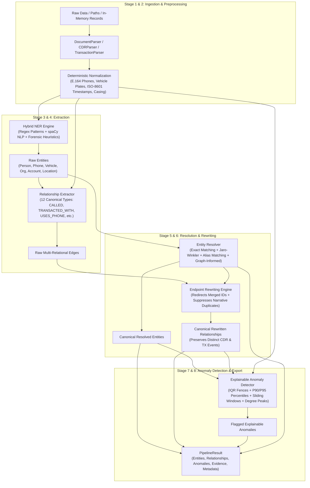

# VERITAS — AI Master Intelligence Pipeline Specification

> **Module Documentation** // Member 1 (AI/NLP + Data)  
> Master Orchestrator, End-to-End Extraction Flow, Schema Conformance, Deterministic Execution, and Member 2 Backend Handoff Guide.

---

## 1. Overview & Purpose

The **Master Intelligence Pipeline** ([`ai/pipeline.py`](file:///C:/Users/omupa/OneDrive/Desktop/VERITAS-/ai/pipeline.py)) is the primary orchestration layer for the VERITAS investigative intelligence platform. It connects all sub-systems constructed across Tasks 1–6 into a deterministic pipeline:

```
Raw Multimodal Inputs (FIRs, CDRs, Transactions, Directories, Loose Records)
                                  │
                                  ▼
                     [ 1. Polymorphic Ingestion ]
                                  │
                                  ▼
                  [ 2. Deterministic Preprocessing ]
                                  │
                                  ▼
                      [ 3. Hybrid NER Extraction ]
                                  │
                                  ▼
                [ 4. Semantic Relationship Extraction ]
                                  │
                                  ▼
                 [ 5. Multi-Signal Entity Resolution ]
                                  │
                                  ▼
             [ 6. Relationship Endpoint Rewriting ]
                                  │
                                  ▼
              [ 7. Explainable Anomaly Detection ]
                                  │
                                  ▼
             [ 8. Canonical PipelineResult JSON Output ]
```

### Primary Objective
To expose a single, production-grade programmatic entrypoint for **Member 2 (Backend/FastAPI/Neo4j)** and forensic investigators:

```python
from ai.pipeline import IntelligencePipeline, PipelineResult, PipelineMetadata
from ai import IntelligencePipeline
```

---

## 2. End-to-End Pipeline Architecture



---

## 3. Programmatic API Reference

### 3.1 Initializing the Pipeline

```python
from ai.pipeline import IntelligencePipeline

# Standard initialization with spaCy (falls back gracefully if model missing)
pipeline = IntelligencePipeline()

# Pure deterministic / headless execution (zero network or NLP dependencies)
pipeline_deterministic = IntelligencePipeline(use_spacy=False)
```

#### Constructor Parameters
| Parameter | Type | Default | Description |
| :--- | :--- | :--- | :--- |
| `use_spacy` | `bool` | `True` | Whether to attempt loading spaCy `en_core_web_sm`. If unavailable, automatically falls back to regex/heuristic NER. |
| `entity_id_generator` | `Optional[EntityIDGenerator]` | `None` | Custom stable ID generator instance. |
| `rel_id_generator` | `Optional[RelationshipIDGenerator]` | `None` | Custom relationship ID generator instance. |
| `entity_resolver` | `Optional[EntityResolver]` | `None` | Custom configured entity resolution and clustering instance. |
| `anomaly_detector` | `Optional[AnomalyDetector]` | `None` | Custom configured explainable anomaly detector instance. |

---

### 3.2 Executing the Pipeline: `pipeline.run(...)`

```python
result: PipelineResult = pipeline.run(
    records=records_list,          # Optional: heterogeneous list of records
    raw_data_path=directory_path   # Optional: directory or file path
)
```

The pipeline accepts heterogeneous inputs polymorphically:
1. **Typed Ingestion Objects**: `DocumentRecord`, `CDRRecord`, `TransactionRecord`.
2. **Raw Narrative Strings**: Plaintext reports, automatically parsed into `DocumentRecord` narratives.
3. **Loose Dictionaries**: E.g. incoming JSON payloads from REST APIs or message brokers (`{"transaction_id": "TX01", ...}`).
4. **Filesystem Paths**: Path to a directory containing `firs/`, `cdrs.csv`, `transactions.csv`, or individual `.txt`/`.csv` files.

---

### 3.3 Data Structures: `PipelineResult` & `PipelineMetadata`

```python
class PipelineResult(BaseModel):
    entities: List[Entity]                      # Canonical resolved entities
    relationships: List[Relationship]          # Rewritten multi-relational graph edges
    anomalies: List[AnomalyResult]              # Flagged explainable behavioral anomalies
    resolution_evidence: List[ResolutionEvidence] # Audit trail of pairwise resolution decisions
    pipeline_metadata: PipelineMetadata        # Execution statistics and operational metrics

    def to_dict(self) -> Dict[str, Any]:
        """Returns standard Python dictionary representation."""
        ...

    def to_json(self, indent: int = 2) -> str:
        """Serializes pipeline result to formatted JSON string."""
        ...
```

```python
class PipelineMetadata(BaseModel):
    records_processed: int       # Total input records ingested
    entity_count_raw: int        # Total entities extracted prior to resolution
    entity_count: int            # Total canonical entities after resolution
    relationship_count_raw: int  # Total relationships before endpoint rewriting
    relationship_count: int      # Total canonical edges after rewriting and narrative deduplication
    anomaly_count: int           # Total behavioral anomalies flagged
    resolution_merge_count: int  # Total entity instances merged into canonical clusters
    status: str                  # "SUCCESS" or "PARTIAL" (if malformed records encountered)
```

---

## 4. Stage-by-Stage Flow & Invariants

### Stage 1: Polymorphic Ingestion
- Ingests heterogeneous data sources simultaneously.
- Gracefully quarantines malformed records while continuing processing for valid inputs.
- Preserves raw input values alongside normalized representations.

### Stage 2: Deterministic Preprocessing
- **Phone Numbers**: Converted to E.164 international standard (e.g. `+919811010001`).
- **Vehicle Plates**: Normalized to standard hyphenated plates (e.g. `DL-1M-4412`).
- **Timestamps**: Normalized to ISO-8601 without speculative UTC time shifting.
- **Account Identifiers**: Casing standardizations and whitespace trimming.

### Stage 3: Hybrid Named Entity Recognition (NER)
- Deterministic regex extractors for `Phone`, `Vehicle`, and `BankAccount`.
- Linguistic model (spaCy) supplemented by contextual forensic heuristics for `Person`, `Location`, and `Organization`.
- Assigns stable, deterministic IDs (e.g. `P001`, `PH001`, `V001`, `BA001`, `LOC001`, `ORG001`).
- Full provenance tracking with source record IDs, exact character spans, and sentence snippets.

### Stage 4: Multi-Relational Extraction
- Extracts all 12 canonical graph relationship types:
  - Structured: `CALLED`, `TRANSACTED_WITH`.
  - Narrative: `USES_PHONE`, `OWNS_VEHICLE`, `OPERATES`, `LOCATED_AT`, `ASSOCIATED_WITH`, `SUPERVISES`, `COORDINATES_WITH`, `CONTROLS`, `MEMBER_OF`, `OWNS_ACCOUNT`.
- Assigns deterministic edge IDs (`R001`, `R002`, ...).
- Adheres to confidence range $[0.0, 1.0]$.
- Distinct CDR call instances and distinct financial transactions are strictly preserved as individual event edges.

### Stage 5 & 6: Multi-Signal Resolution & Relationship Rewriting
- Resolves cross-record entities using multi-signal fusion:
  - Exact deterministic match for phones, vehicles, and bank accounts.
  - Case-insensitive string and alias matching for persons.
  - Suffix-normalized matching for organizations.
- Rewrites relationship `source` and `target` endpoints to canonical cluster IDs.
- Deduplicates narrative assertions while keeping structured transaction/call events intact.

### Stage 7: Explainable Anomaly Detection
- Computes distribution baselines across transactions, CDRs, and graph connectivity.
- Flags statistical outliers (`HIGH_TRANSACTION_AMOUNT`, `HIGH_TRANSACTION_FREQUENCY`, `HIGH_CALL_FREQUENCY`, `BURST_ACTIVITY`, `HIGH_CONNECTIVITY`, `CROSS_COMMUNITY_BRIDGE`).
- Binds quantitative evidence snippets and human-readable, non-accusatory explanations to each detection.

### Stage 8: Canonical Graph Assembly & Metadata Auditing
- Validates graph consistency: every relationship endpoint references a valid entity.
- Records audit metrics in `PipelineMetadata`.
- Generates compliant, serializable `PipelineResult`.

---

## 5. Provenance Retention & Determinism Guarantees

1. **Evidentiary Provenance**:
   - Every entity retains its originating `source_records` list and `attributes` (`snippet`, `char_spans`, `confidence`).
   - Every relationship includes a structured `Provenance` object (`source_id`, `source_type`, `snippet`, `confidence`).
   - Every anomaly retains its `supporting_record_ids` and `feature_values`.
2. **Strict Determinism**:
   - Repeated execution over identical data yields byte-identical entity IDs, relationship IDs, and canonical clusters.
   - Independent runs produce consistent graph structures without random hash drift.

---

## 6. Member 2 (Backend / FastAPI) Integration Guide

Member 2 can integrate the pipeline directly into FastAPI routers or background task workers:

```python
from fastapi import APIRouter, UploadFile, HTTPException
from ai.pipeline import IntelligencePipeline, PipelineResult

router = APIRouter(prefix="/api/intelligence", tags=["Intelligence"])
pipeline = IntelligencePipeline()

@router.post("/process-batch", response_model=None)
async def process_investigation_batch(payload: dict) -> dict:
    """
    Ingests investigation files or records, runs end-to-end extraction,
    and returns canonical graph nodes, edges, anomalies, and audit metrics.
    """
    records = payload.get("records", [])
    if not records:
        raise HTTPException(status_code=400, detail="No records provided")

    result: PipelineResult = pipeline.run(records=records)
    
    # Handoff directly to Neo4j ingestion service or Cytoscape serializer
    return result.to_dict()
```

---

## 7. Verification & Test Suite Summary

The pipeline is verified against 16 comprehensive unit and regression tests in [`tests/ai/test_pipeline.py`](file:///C:/Users/omupa/OneDrive/Desktop/VERITAS-/tests/ai/test_pipeline.py):

| Test Scenario | Verification Focus | Result |
| :--- | :--- | :---: |
| `test_pipeline_empty_input` | Empty list or null arguments return safe zero-count result | `PASSED` |
| `test_pipeline_fir_document` | Narrative reports extract persons, phones, vehicles, and edges | `PASSED` |
| `test_pipeline_cdr_records` | CDR batches extract normalized phones and `CALLED` edges | `PASSED` |
| `test_pipeline_transaction_records` | Bank ledgers extract accounts and `TRANSACTED_WITH` edges | `PASSED` |
| `test_pipeline_mixed_multi_source` | Heterogeneous batch (FIR + CDR + TX) processes seamlessly | `PASSED` |
| `test_entity_extraction_reaches_final_output` | Document entities reach final result set | `PASSED` |
| `test_relationship_extraction_reaches_final_output` | Narrative relationships reach final result set | `PASSED` |
| `test_entity_resolution_endpoint_rewriting` | Merged entities update edge endpoints to canonical IDs | `PASSED` |
| `test_anomalies_reach_final_output` | High transaction spikes trigger explainable anomalies | `PASSED` |
| `test_provenance_survives_all_stages` | 100% provenance retention across all 8 stages | `PASSED` |
| `test_deterministic_repeated_execution` | Repeated runs generate identical IDs and structures | `PASSED` |
| `test_malformed_record_handling` | Invalid records trigger `PARTIAL` status without crash | `PASSED` |
| `test_missing_spacy_fallback` | Pure deterministic fallback executes when spaCy is disabled | `PASSED` |
| `test_json_serialization` | `.to_json()` produces valid schema-compliant JSON | `PASSED` |
| `test_output_satisfies_canonical_schemas` | Full compliance with `Entity` and `Relationship` schemas | `PASSED` |
| `test_full_chain_integration` | End-to-end integration across FIR, CDR, TX, Resolution, Anomalies | `PASSED` |

Total test suite status: **104/104 AI tests passing**, **6/6 pipeline integrity audit checks passing**.
